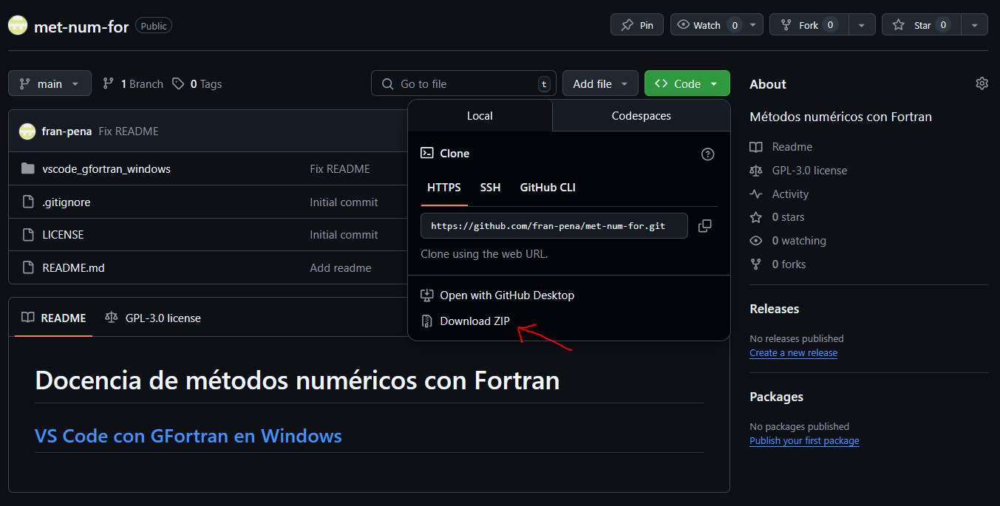

# VS Code con GFortran en Windows

## Exemplos

### [Exemplo 1: sen entrada](./exemplo1_sen_entrada/README.md)

### Descarga dos exemplos

1. Vai á páxina principal deste repositorio en github: [https://github.com/fran-pena/met-num-for/](https://github.com/fran-pena/met-num-for/)

2. Pulsa en **Code** - **Download ZIP**



3. Descomprime o ficheiro; na carpeta *vscode_gfortran_windows\exemplos* atoparás os cartafoles de proxecto de cada exemplo. 

### Apertura dun proxecto de exemplo existente

Cada exemplo está radicado nun _cartafol de proxecto_, que contén o cartafol _.vscode_ con ficheiros de configuración.

Para abrir un proxecto existente, en VS Code vai ao menú **File - Open folder...** (ou preme Ctrl + K, Ctrl + O) e abre o cartafol do proxecto; por exemplo, *vscode_gfortran_windows\exemplos\exemplo1_sen_entrada*.

Dentro deste cartafol debe existir outro denominado _.vscode_, que contendo polo menos os dous primeiros ficheiros dos explicados a continuación.

### Compilación
O ficheiro _tasks.json_ contén as regras de compilación (grupo **build**) e probas (grupo **test**).
  - Para usar as regras de _tasks.json_ do grupo **build**, vai ao menú **Terminal - Run Build Task...** (ou preme Ctrl + Shift + B) e escolle a regra.

  - Para usar calquera outra regra de _tasks.json_, vai ao menú **Terminal - Run Task...** e escolle a regra.

### Depuración e execución
O ficheiro _launch.json_ contén as regras de depuración e execución.

Para depurar usando estas regras:
    
  - Fai clic á esquerda dun número de liña no código Fortran, para engadir un punto de interrupción (_breakpoint_),

  - Vai ao menú **Run - Start debugging...** (ou preme F5).

Para executar sen depuración, vai ao menú **Run - Start Without debugging...** (ou preme Ctrl + F5).

### Extensións requeridas

O ficheiro _extensions.json_ é opcional e contén as extensións recomendadas. No noso caso, **Modern Fortran**. Para instalala, debes seguir estes pasos: 

1. Abre **Visual Studio Code**.
2. Vai á barra lateral esquerda e preme en **Extensións** (ou pulsa `Ctrl + Maiús + X`).
3. Na barra de busca, escribe: `Modern Fortran`.
4. Abre a páxina da extensión chamada **Modern Fortran** (publicada por `fortran-lang`).
5. Preme na **roda dentada ⚙️**.
6. Preme en **Instalar**.
7. Marca que **confías na extensión** se VS Code che pide confirmación.

Alternativamente, podes instalar desde terminal con:

```bash
code --install-extension fortran-lang.linter-gfortran
```

### Creación dun novo proxecto

É necesario crear dentro do cartafol do proxecto polo menos os ficheiros *.vscode/tasks.json* e *.vscode/launch.json* coas regras de compilación, depuración e execución.

O cartafol de proxecto non ten por que conter as fontes do proxecto, dependerá das rutas que se indiquen para cada fonte na regra de compilación de _launch.json_.

Visita os cartafoles de exemplos de proxecto deste repositorio para entender os cambios requeridos nos ficheiros de configuración debidos a diferentes xeitos de tratar a entrada e saída do programa.