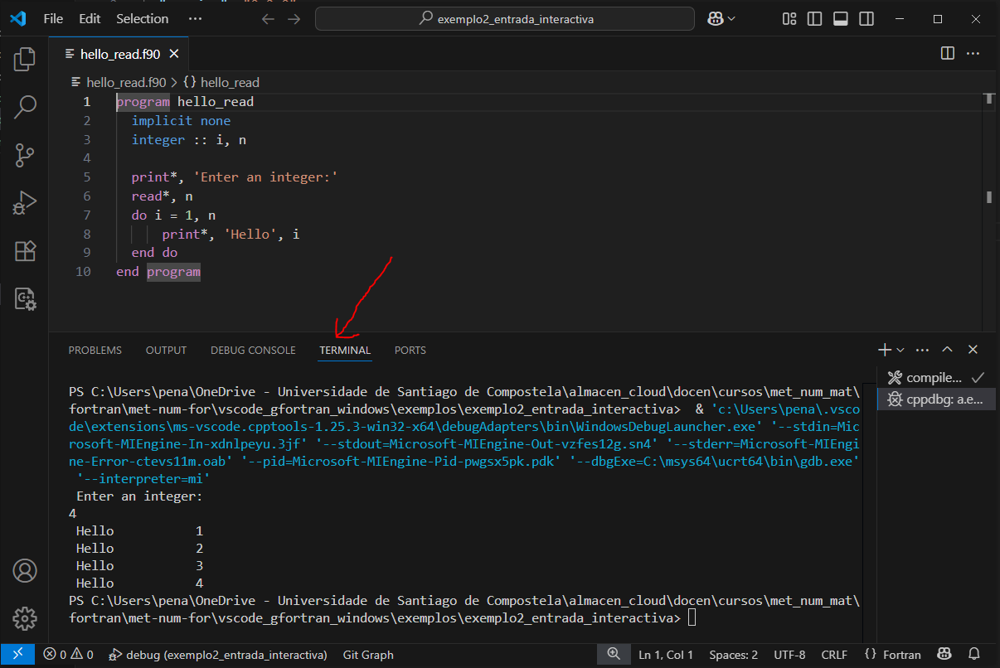

# VS Code con GFortran en Windows

## Exemplo 2: entrada interactiva

### Fontes

O ficheiro [*hello_read.f90*](./hello_read.f90) solicita datos pola entrada estándar:

```fortran
program hello_read
  implicit none
  integer :: i, n

  print*, 'Enter an integer:'
  read*, n
  do i = 1, n
      print*, 'Hello', i
  end do
end program  
```

### Compilación

En [*.vscode/tasks.json*](./.vscode/tasks.json) se define a regra _compile_ no grupo _build_, que compila con argumentos:

```json
"args": ["-Wall", "-g", "-o", "a.exe", "hello_read.f90"]
```

Para saber como construir o executable con esta regra, consulta o [README](../README.md#Compilación) da carpeta de exemplos.

### Depuración e execución

En [*.vscode/launch.json*](./.vscode/launch.json) se define a regra _debug_ para depuración e execución. Primeiro declara _compile_ como requisito:
```json
"preLaunchTask": "compile"
```
Logo chama ao executable:
```json
"program": "${workspaceFolder}/a.exe"
```

Por defecto, úsase a terminal integrada en VS Code para solicitar datos e mostrar o resultado. Se non cambia automáticamente da **DEBUG CONSOLE** á **TERMINAL**, debes escoller esta última 



Para saber como depurar ou executar con esta regra, consulta o [README](../README.md#Depuración-e-execución) da carpeta de exemplos.
