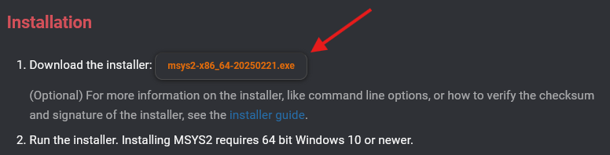
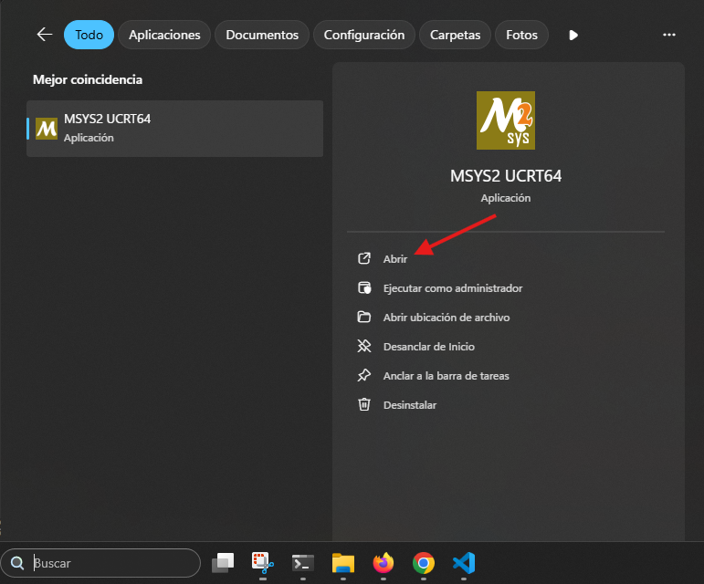
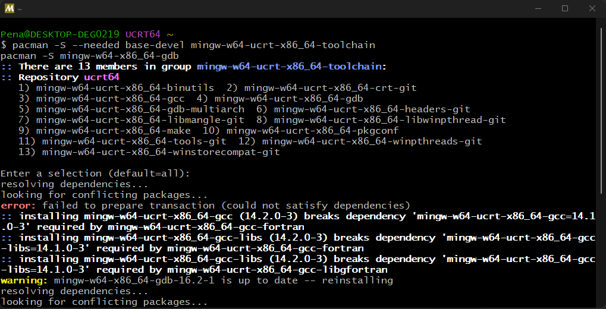
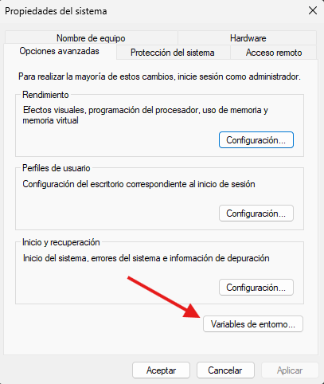
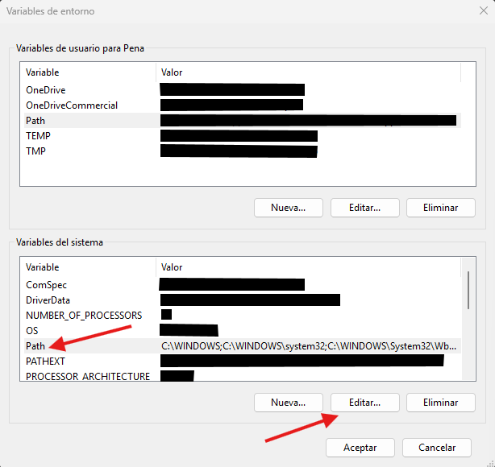
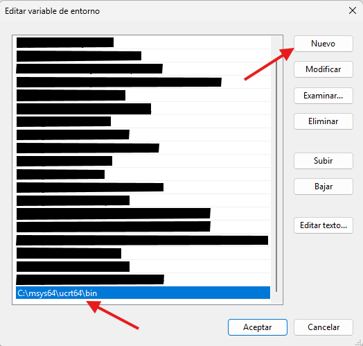
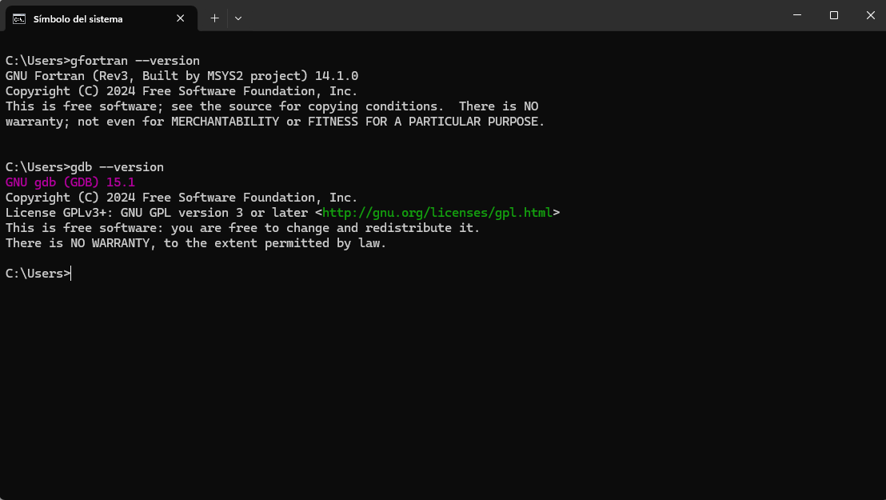
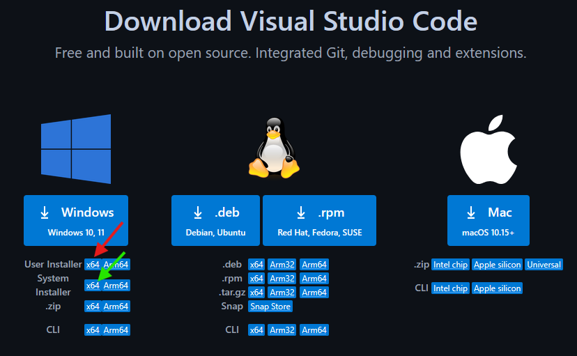
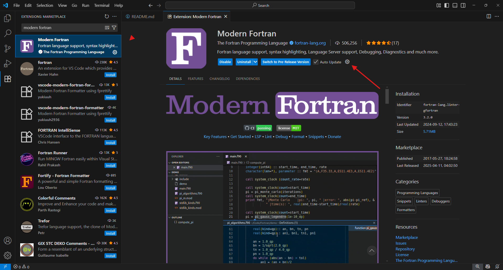

# VS Code con GFortran en Windows

## Instalación

### Instalación de GFortran

1. Vai á páxina [www.msys2.org](https://www.msys2.org/) e baixa o instalador.



2. Instala o GFortran, mantendo as opcións por defecto.

3. Se tras a instalación non se abre a terminal MSYS2 UCRT64, vai ao cadro de busca da barra de tarefas de Windows, busca **MSYS2 UCRT64** e ábrea.



4. Copia os seguintes comandos á terminal:
```shell
pacman -S --needed base-devel mingw-w64-ucrt-x86_64-toolchain
pacman -S mingw-w64-x86_64-gdb
```
Pégaos na terminal co botón dereito do rato, escollendo **Pegar**. Acepta as opcións por defecto pulsando **Intro** en todas as preguntas.



5. No cadro de busca da barra de tarefas de Windows, busca **Editar las variables de entorno del sistema** e ábrea.

6. No cadro **Propiedades del sistema**, pulsa en **Variables de entorno**.



7. No cadro **Variables de entorno**, na sección **Variables del sistema**, escolle **Path** e pulsa en **Editar...**.



8. No cadro **Editar variable de entorno**, pulsa en **Nuevo** e introduce a ruta de instalación do GFortran (por defecto, `C:\msys64\ucrt64\bin`).



9. Para testar a instalación, vai ao cadro de busca da barra de tarefas de Windows, busca **CMD** ou **Símbolo del sistema** e ábreo.

10. Copia e pega estes comandos no **Símbolo del sistema**. 

```shell
gfortran --version
gdb --version
```

Deberías ver unha saída semellante á seguinte:



### Instalación de Visual Studio Code

1. Vai á paxina de descarga de Visual Studio Code (VS Code): [code.visualstudio.com/download](https://code.visualstudio.com/download).

  a. Se queres instalalo só para o teu usuario, pulsa na frecha vermella da imaxe seguinte.
  
  b. Se queres instalalo para todos os usuarios do sistema, pulsa na frecha verde da imaxe seguinte. Durante a instalación se che pedirá que permitas cambios no sistema.
  



2. Abre VS Code, vai a **Extensions** na barra lateral esquerda (ou pulsa Ctrl + Mays + X) e  busca **Modern Fortran**. Na páxina que se abre, pulsar na roda dentada (ver frecha vermella na imaxe). Pulsa en **Instalar** e marca que confías na extensión.




### Instalación de GNU Octave

No caso de querer executar o [Exemplo 5](./exemplos/exemplo5_imaxe_de_saida/) e non dispoñer dunha instalación de Matlab, pódese adaptar o exemplo a GNU Octave. Para instalalo, hai que seguir os pasos indicados na [Instalación de GFortran](./README#Instalación-de-GFfortran) e, no punto 4., engadir o seguinte comando a executar na terminal MSYS2 UCRT64:

```shell
pacman -S  mingw-w64-ucrt-x86_64-octave
```